# SecureTask Security Test Results

## Week 3 — Manual Security Testing

### XSS

**Test:** Submitted XSS payloads through task fields.

**Payloads:**

- ``
- ``

**Result:** The backend accepted the values as data and the React frontend rendered the payloads as text. JavaScript did not execute.

**Status:** PASS

**Evidence:**

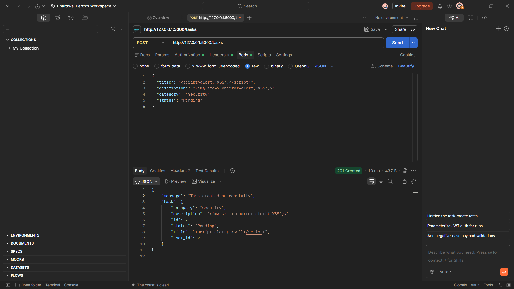

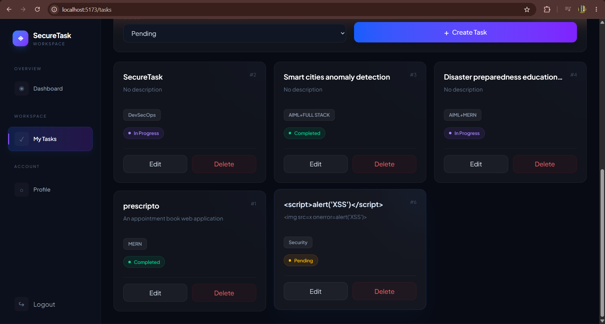

---

### IDOR / Authorization

**Test:** User A attempted to modify a task belonging to User B.

**Result:** The application returned `404 - Task not found or not authorised`.

**Status:** PASS

**Evidence:**

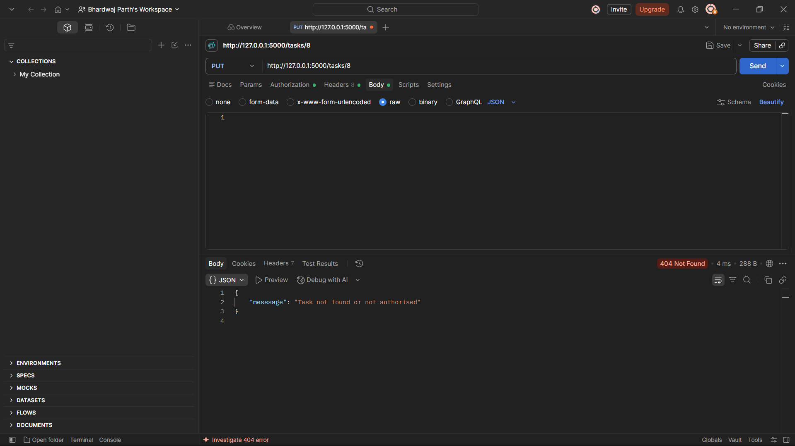

---

### SQL Injection

**Test:** SQL injection-style input was submitted to the login endpoint.

**Result:** The application returned `401 Unauthorized` and did not authenticate the request.

**Status:** PASS

**Evidence:**

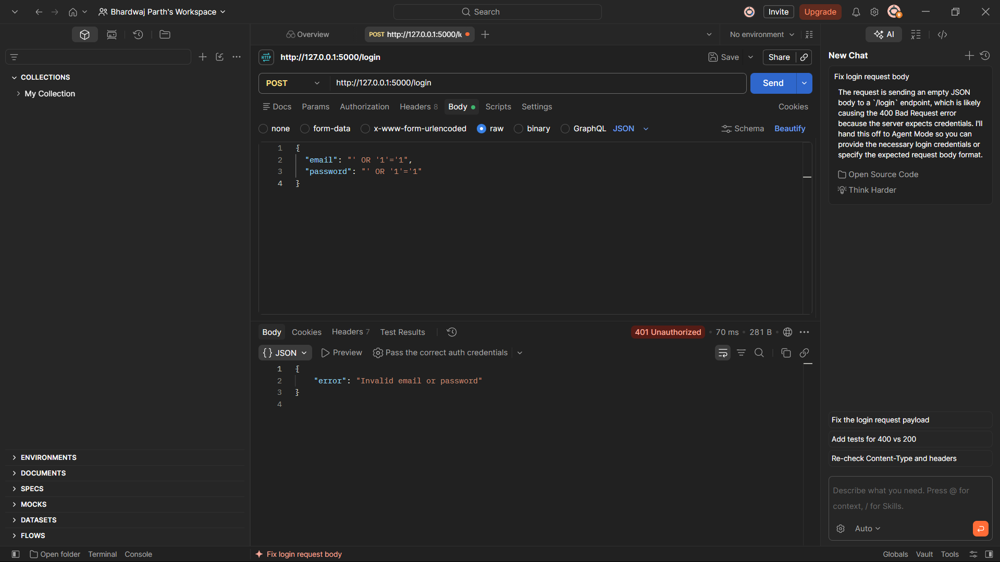

---

### Authentication Bypass

**Test:** Attempted to access a protected endpoint without an Authorization header.

**Result:** The application returned `401 Unauthorized` with `Missing Authorization Header`.

**Status:** PASS

**Evidence:**

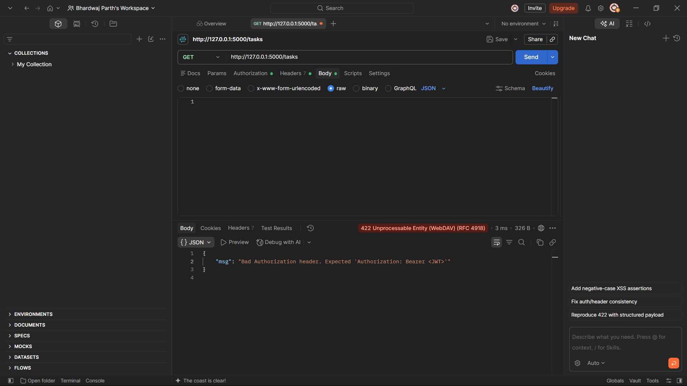

---

### Password Hashing

**Test:** Inspected the authentication implementation and database password values.

**Result:** Passwords are stored as bcrypt hashes rather than plaintext values.

**Status:** PASS

**Evidence:**

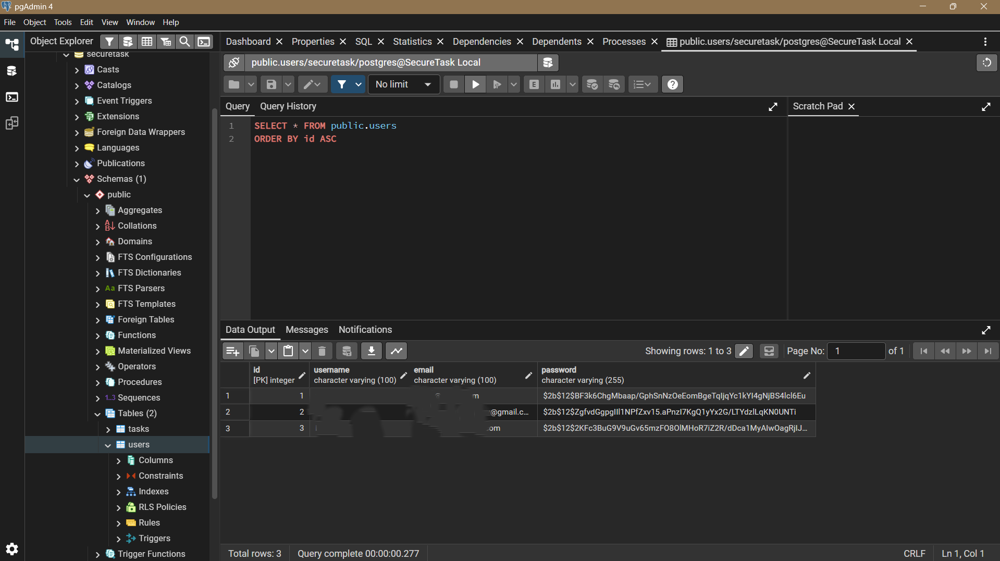

---

### Invalid Task ID

**Test:** Submitted a request using a non-existent task ID.

**Result:** The application returned a controlled `404` response without exposing internal information.

**Status:** PASS

**Evidence:**

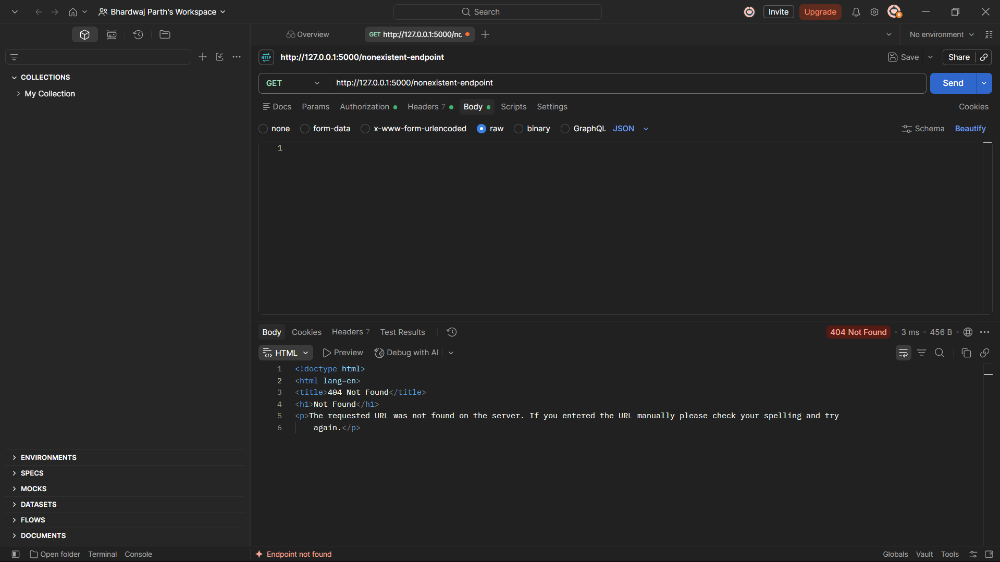

---

### Malformed JSON

**Test:** Submitted malformed JSON to an API endpoint.

**Result:** The application returned a controlled error response without exposing sensitive internal information.

**Status:** PASS

**Evidence:**

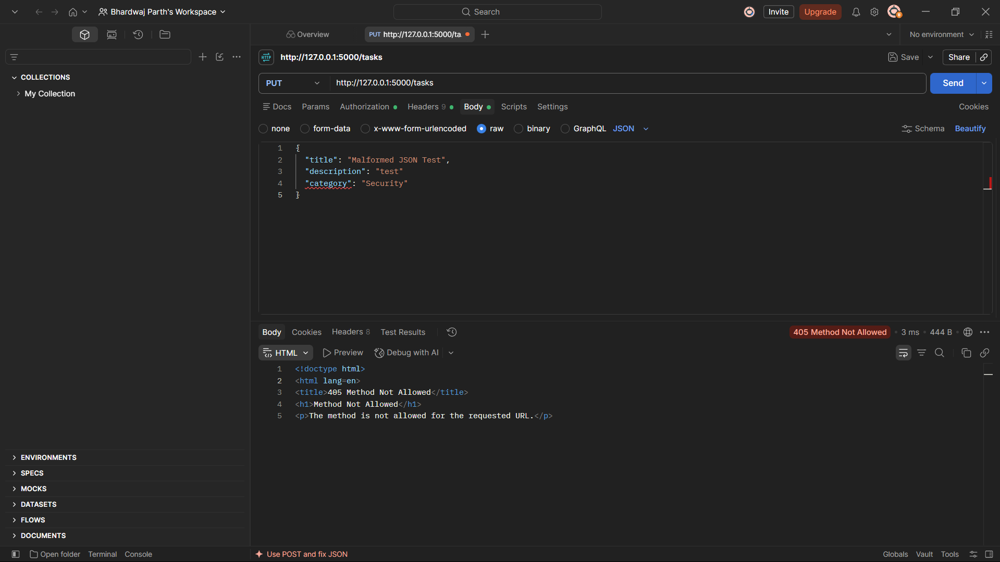

---

### Verbose Error Handling

**Tests:**

1. Non-existent endpoint
2. Malformed JSON
3. Invalid task ID

**Result:** No Python traceback, database credentials, filesystem paths, source-code details, or other sensitive internal information were exposed.

**Status:** PASS

**Evidence:**

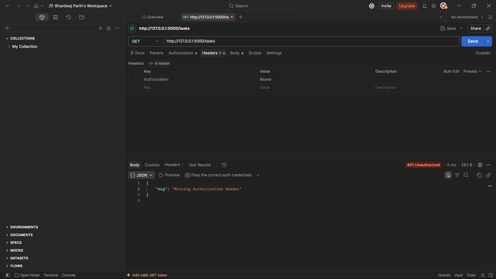

---

### Directory Traversal

**Test:** Reviewed the backend for file/path handling functionality.

**Result:** No user-controlled filesystem path or file download functionality exists.

**Status:** N/A

---

### Insecure File Upload

**Test:** Reviewed the backend for file-upload functionality.

**Result:** No file-upload endpoint exists.

**Status:** N/A

---

## Week 3 Summary

| Security Test | Result |
|---|---|
| SQL Injection | PASS |
| XSS | PASS |
| Authentication Bypass | PASS |
| IDOR / Authorization | PASS |
| Password Hashing | PASS |
| Invalid Task ID | PASS |
| Malformed JSON | PASS |
| Verbose Error Handling | PASS |
| Directory Traversal | N/A |
| Insecure File Upload | N/A |

**Week 3 Manual Security Testing: COMPLETE**

---

# Week 4 — SAST & Secret Scanning

## Bandit

**Tool:** Bandit 1.9.4

### Initial Scan

- Scope: SecureTask backend
- Virtual environment excluded
- High severity: 1
- Medium severity: 0
- Low severity: 1

### Findings

#### B105 — Hardcoded Password String

- Location: `backend/app.py`
- Issue: A credential-like value was present in application source code during controlled testing.
- Remediation: The hardcoded test value was removed and sensitive configuration remained environment-based.

#### B201 — Flask Debug Enabled

- Location: `backend/app.py`
- Issue: Flask was configured with `debug=True`.
- Remediation: Flask configuration was changed to `debug=False`.

### Final Scan

- High severity: 0
- Medium severity: 0
- Low severity: 0

**Status:** PASS

**Evidence:**

---

## Semgrep OSS

**Tool:** Semgrep OSS

**Configuration:** Semgrep OSS `auto` configuration.

### Final Results

- Rules executed: **459**
- Targets scanned: **46**
- Findings: **0**
- Blocking findings: **0**

**Status:** PASS

**Evidence:**

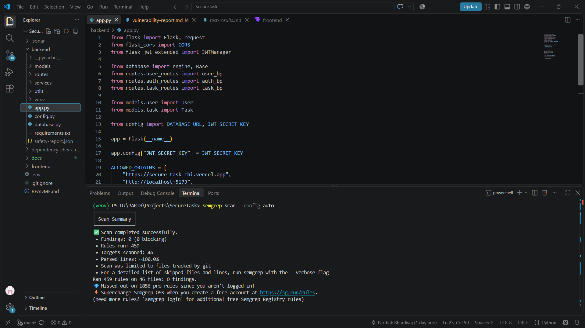

**Scope Note:** The scan used Semgrep OSS. Additional Semgrep Code/Supply Chain rules were not included because the CLI was not authenticated for those features.

---

## Gitleaks

**Tool:** Gitleaks 8.30.1

**Test:** Git repository secret scanning.

### Final Results

- Git commits scanned: **17**
- Repository data scanned: approximately **317.45 KB**
- Leaks found: **0**

**Status:** PASS

**Evidence:**

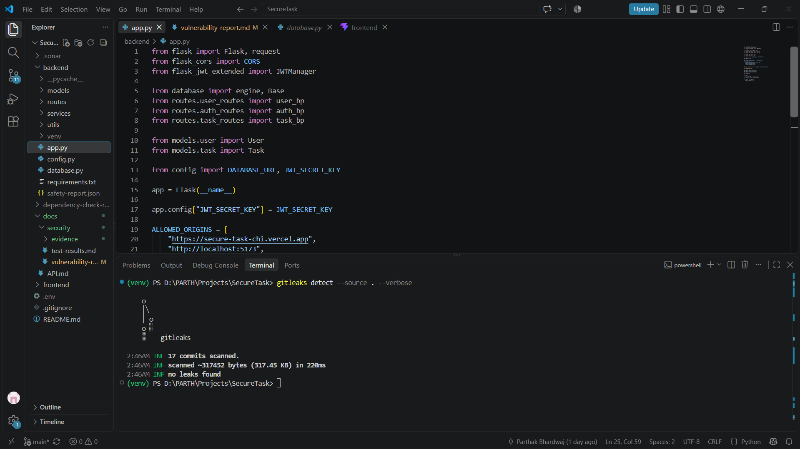

---

## Week 4 Summary

| Security Tool | Result |
|---|---|
| Bandit | PASS — 0 findings after remediation |
| Semgrep OSS | PASS — 0 findings |
| Gitleaks | PASS — 0 leaks |

**Week 4 SAST & Secret Scanning: COMPLETE**

---

# Week 5 — Dependency Security & SonarQube Assessment

## 1. OWASP Dependency-Check

**Tool:** OWASP Dependency-Check 12.1.0

### Scope

- Backend `requirements.txt`
- Frontend `package-lock.json`

### Initial Scan

The initial dependency assessment identified one vulnerable frontend dependency:

| Dependency | Version | Severity | Vulnerability |
|---|---:|---|---|
| `nanoid` | 3.3.17 | Medium | GHSA-2v37-7h3g-55p8 |

The affected version range was below `3.3.18`.

The vulnerability was associated with CWE-835 (Infinite Loop).

**Status:** FINDING IDENTIFIED

**Evidence:**

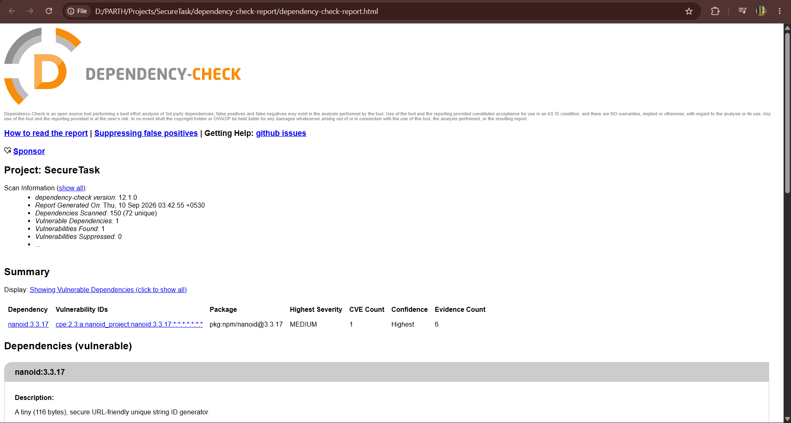

### Analysis

The vulnerable dependency was a transitive frontend dependency:

`vite → postcss → nanoid`

The installed version `3.3.17` was within the affected version range.

### Remediation

The dependency was updated using:

`npm update nanoid`

The resulting installed version was:

`nanoid@3.3.18`

The updated version is outside the affected version range.

### Re-scan

OWASP Dependency-Check was executed again after remediation.

### Final Result

- Dependencies scanned: **150 (72 unique)**
- Vulnerable dependencies: **0**
- Vulnerabilities found: **0**
- Vulnerabilities suppressed: **0**

**Status:** PASS

**Evidence:**

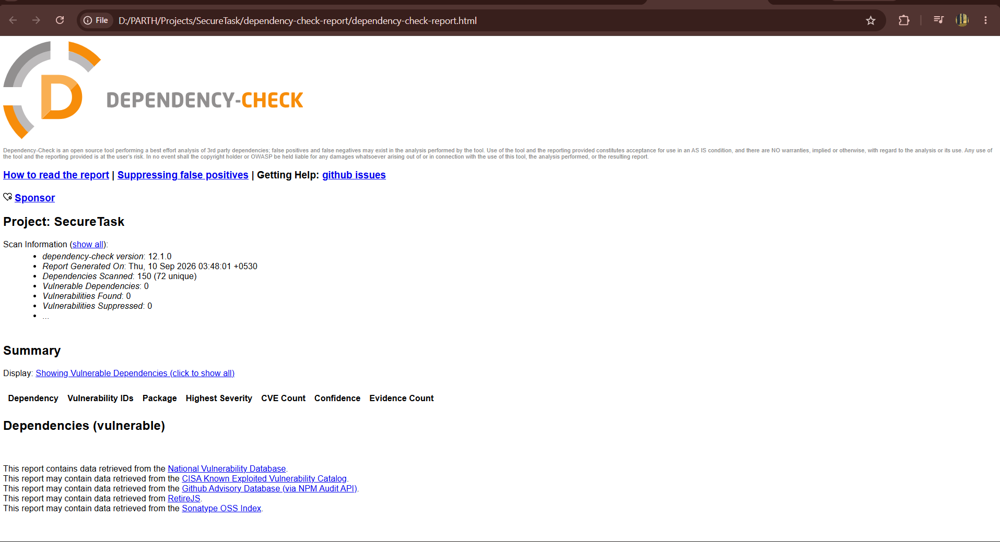

### Outcome

The detected `nanoid` vulnerability was successfully remediated and was no longer reported during the final Dependency-Check scan.

---

## 2. pip-audit

**Tool:** pip-audit

### Application Dependency Audit

**Command:**

`pip-audit -r backend\requirements.txt`

**Result:**

`No known vulnerabilities found`

**Status:** PASS

**Evidence:**

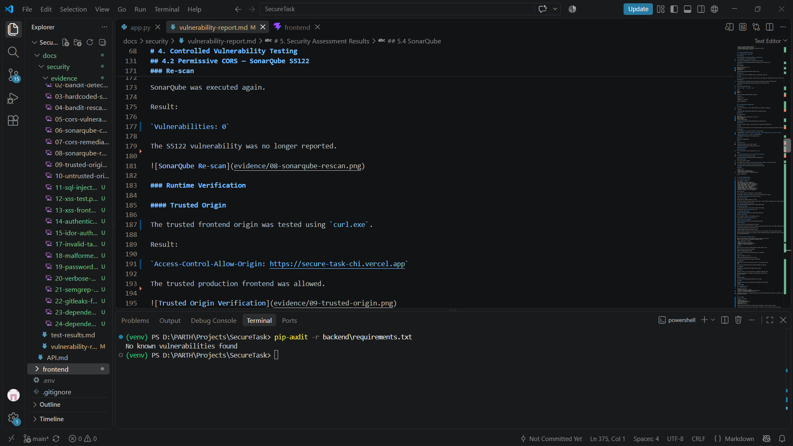

### Environment Audit

A separate audit of the complete development virtual environment previously identified an NLTK-related vulnerability.

- Package: `nltk 3.10.3`
- Vulnerability ID: `PYSEC-2026-3740`
- NLTK is not listed in the application's `backend\requirements.txt`
- The package was present as a dependency of security-scanning tooling

**Status:** Informational / Tooling Dependency Finding

No SecureTask application dependency was identified as vulnerable by the application requirements audit.

---

## 3. Safety

**Tool:** Safety 3.8.1

### Application Dependency Check

**Command:**

`safety check -r backend\requirements.txt`

**Result:**

- 0 vulnerabilities reported
- 0 vulnerabilities ignored
- No known security vulnerabilities reported

**Status:** PASS

**Evidence:**

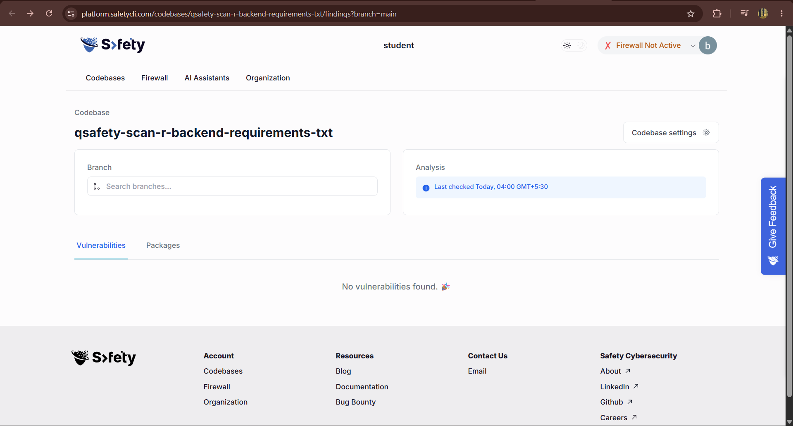

### Environment Scan Note

A separate `safety scan` of the complete development project/environment identified one vulnerability that was ignored by the active Safety policy.

This finding was associated with the development/tooling environment rather than a declared SecureTask runtime dependency.

Therefore, the Safety result for the application's declared backend dependencies is considered PASS.

---

# 4. SonarQube

**Tool:** SonarQube Community Build 26.9.0.129388

**Scanner:** PySonar 1.8.0.5390

### Scope

- SecureTask backend
- SecureTask frontend
- Python
- JavaScript
- CSS
- JSON
- Web files

### Initial Analysis

The initial SonarQube analysis detected:

- Total issues: **43**
- Security vulnerabilities: **2**
- Reliability issues: **32**
- Maintainability issues: **23**
- Coverage: **0.0%**
- Quality Gate: **Passed**

Two security-related findings required analysis.

### Security Finding 1 — CSRF Protection

- Location: `backend/app.py`
- Rule: `python:S4502`
- Severity: Critical

**Issue:** SonarQube reported that CSRF protection was not explicitly configured.

### Analysis

The finding was reviewed against the application's authentication architecture.

SecureTask uses JWT authentication through the explicit:

`Authorization: Bearer`

HTTP header rather than browser cookies.

Therefore, the finding was classified as a **false positive** for the implemented authentication architecture.

No cookie-based CSRF mechanism was added because it was not required by the implemented JWT authentication model.

**Outcome:** Reviewed and classified as False Positive

---

### Security Finding 2 — Permissive CORS

- Location: `backend/app.py`
- Rule: `python:S5122`
- Severity: Major

**Issue:** CORS configuration was overly permissive.

### Original Configuration

`CORS(app)`

### Remediation

The CORS configuration was restricted to explicitly trusted origins:

- `https://secure-task-chi.vercel.app`
- `http://localhost:5173`
- `http://127.0.0.1:5173`

**Evidence:**

### Runtime Validation

A request using the trusted frontend origin returned:

`Access-Control-Allow-Origin: https://secure-task-chi.vercel.app`

The trusted frontend was therefore allowed.

A request using an untrusted origin did not receive an `Access-Control-Allow-Origin` header.

The untrusted origin was therefore not granted CORS permission.

### Re-scan

After remediation, SonarQube was executed again.

### Final Results

- Total issues: **41**
- Security vulnerabilities: **0**
- Critical vulnerabilities: **0**
- Major vulnerabilities: **0**
- New issues: **0**
- Quality Gate: **Passed**
- Code coverage: **0.0%**
- Duplications: **0.0%**

**Status:** PASS

**Evidence:**

### SonarQube Scope Note

The SonarQube Community Build provides a more limited security analysis compared with higher SonarQube editions.

Therefore, SonarQube results are treated as an additional security and code-quality layer and are not considered a replacement for manual security testing, Bandit, Semgrep, Gitleaks, dependency auditing, and runtime security verification.

---

# Week 5 Summary

| Tool | Scope | Result | Status |
|---|---|---|---|
| OWASP Dependency-Check | Backend + frontend dependencies | 0 vulnerabilities after remediation | PASS |
| pip-audit | SecureTask `requirements.txt` | 0 vulnerabilities | PASS |
| pip-audit | Complete virtual environment | 1 tooling dependency finding | INFORMATIONAL |
| Safety | SecureTask `requirements.txt` | 0 vulnerabilities | PASS |
| Safety | Complete environment | 1 policy-ignored finding | INFORMATIONAL |
| SonarQube | Backend + frontend | 0 security vulnerabilities after remediation | PASS |

---

# Week 5 Security Conclusion

The dependency security assessment identified one Medium-severity vulnerability in the transitive `nanoid` dependency.

The affected version `3.3.17` was upgraded to `3.3.18`, and the subsequent OWASP Dependency-Check re-scan reported zero vulnerable dependencies and zero vulnerabilities.

The application dependency audits performed with pip-audit and Safety reported no known vulnerabilities in the declared backend requirements.

Additional environment-level findings were identified in development tooling dependencies. These were not declared SecureTask runtime dependencies and were therefore treated as informational tooling findings.

SonarQube initially identified two security-related findings. The CSRF finding was reviewed and classified as a false positive based on the application's JWT header-based authentication architecture. The permissive CORS vulnerability was remediated by restricting access to trusted origins and verified using both trusted and untrusted HTTP origins.

The final SonarQube analysis reported:

**0 security vulnerabilities**

**0 Critical vulnerabilities**

**0 Major vulnerabilities**

**Quality Gate: Passed**

**Week 5 — Dependency Security & SonarQube Assessment: COMPLETE**