# SecureTask — Security Test Results

## Overview

SecureTask was developed with a security-first approach. Security testing was performed throughout the development process using manual security testing, static application security testing (SAST), secret scanning, dependency vulnerability assessment, code-quality analysis, Dynamic Application Security Testing (DAST), controlled vulnerability testing, remediation, and runtime verification.

The security assessment followed the lifecycle:

**Scan → Detection → Analysis → Remediation → Re-scan → Verification → Outcome**

The objective was to identify security weaknesses, understand their root causes, apply appropriate remediation, and verify the resulting application behavior.

---

# Week 3 — Manual Security Testing

## 1. SQL Injection

### Objective

Test whether user-controlled input could manipulate SQL queries and access unauthorized database information.

### Test

SQL injection payloads were submitted through application inputs and API requests.

### Result

The application handled the input without allowing SQL query manipulation.

Parameterized/database abstraction through SQLAlchemy prevented direct SQL injection.

**Status:** PASS

**Evidence:**

---

## 2. Cross-Site Scripting (XSS)

### Objective

Test whether malicious JavaScript could be injected and executed through task-related input.

### Test

XSS payloads were submitted through task input fields.

### Result

The malicious payload was not executed as JavaScript.

React's default rendering behavior escaped the supplied content.

**Status:** PASS

**Evidence:**

---

## 3. Authentication Bypass

### Objective

Determine whether protected endpoints could be accessed without valid authentication.

### Test

Protected API endpoints were accessed without a valid JWT.

### Result

The application rejected unauthenticated requests.

**Status:** PASS

**Evidence:**

---

## 4. IDOR / Authorization

### Objective

Determine whether an authenticated user could access or modify another user's tasks by manipulating task identifiers.

### Test

Task identifiers belonging to another user were supplied in API requests.

### Result

The backend verified task ownership before allowing access or modification.

Unauthorized task access was rejected.

**Status:** PASS

**Evidence:**

---

## 5. Invalid Task ID Handling

### Objective

Test how the API handles invalid task identifiers.

### Test

Invalid task IDs were supplied to task-related endpoints.

### Result

The application returned a controlled response rather than exposing an unhandled server exception.

**Status:** PASS

**Evidence:**

---

## 6. Malformed JSON Handling

### Objective

Determine whether malformed JSON input could cause an unhandled application exception.

### Test

Malformed JSON payloads were submitted to the API.

### Result

The API handled malformed requests without exposing a Python traceback to the client.

**Status:** PASS

**Evidence:**

---

## 7. Password Hashing

### Objective

Verify that user passwords are not stored in plaintext.

### Test

The stored password representation was inspected and bcrypt password verification behavior was tested.

### Result

Passwords are stored using bcrypt hashing rather than plaintext storage.

**Status:** PASS**

**Evidence:**

---

## 8. Verbose Error Handling

### Objective

Determine whether application errors expose sensitive implementation details.

### Test

Invalid input and error conditions were triggered.

### Result

The application returned controlled error responses without intentionally exposing internal implementation details to normal clients.

**Status:** PASS

**Evidence:**

---

## 9. Directory Traversal

### Objective

Determine whether user-controlled filesystem paths could be manipulated to access arbitrary files.

### Result

The current application does not provide user-controlled filesystem path functionality.

**Status:** NOT APPLICABLE

---

## 10. Insecure File Upload

### Objective

Determine whether malicious files could be uploaded and executed or stored insecurely.

### Result

The current application does not provide file-upload functionality.

**Status:** NOT APPLICABLE

---

# Week 3 Security Summary

| Test | Result |
|---|---|
| SQL Injection | PASS |
| Cross-Site Scripting (XSS) | PASS |
| Authentication Bypass | PASS |
| IDOR / Authorization | PASS |
| Invalid Task ID Handling | PASS |
| Malformed JSON Handling | PASS |
| Password Hashing | PASS |
| Verbose Error Handling | PASS |
| Directory Traversal | NOT APPLICABLE |
| Insecure File Upload | NOT APPLICABLE |

**Week 3 Manual Security Testing: COMPLETE**

---

# Week 4 — Static Application Security Testing and Secret Scanning

## 1. Bandit

### Objective

Perform static security analysis of the Python backend and identify common Python security issues.

### Initial Scan

The initial Bandit scan identified:

- B105 — Hardcoded Password String
- B201 — Flask Debug Mode Enabled

The B105 finding was caused by a controlled hardcoded test secret introduced during security testing.

The B201 finding was caused by Flask debug mode being enabled.

### Remediation

The controlled hardcoded secret was removed.

The JWT secret was moved to environment-based configuration.

Flask debug mode was disabled for the application runtime.

The application was changed from development debug execution to:

`debug=False`

### Final Scan

The final Bandit scan reported:

- High: 0
- Medium: 0
- Low: 0

**Status:** PASS

**Evidence:**

---

## 2. Semgrep OSS

### Objective

Perform additional static analysis using Semgrep OSS security rules.

### Final Results

- Rules executed: 459
- Targets scanned: 46
- Findings: 0

**Status:** PASS

**Evidence:**

---

## 3. Gitleaks

### Objective

Detect secrets or credentials accidentally committed to Git history.

### Final Results

- Commits scanned: 17
- Repository data scanned: approximately 317.45 KB
- Leaks detected: 0

**Status:** PASS

**Evidence:**

---

# Controlled Vulnerability Testing

Controlled vulnerabilities were intentionally introduced in a test environment to verify that security tools could detect known insecure configurations.

The vulnerable configurations were removed and remediated before the final application state.

The controlled testing lifecycle followed:

**Introduction → Detection → Analysis → Remediation → Re-scan → Verification**

---

## Controlled Case 1 — Hardcoded Secret

### Introduction

A test-only hardcoded secret was temporarily introduced into the backend source code.

The value was used only for controlled security testing.

### Detection

Bandit identified the hardcoded password string as:

**B105 — hardcoded_password_string**

Severity:

**Low**

Confidence:

**Medium**

CWE:

**CWE-259**

### Remediation

The test-only hardcoded secret was removed from the application source code.

Sensitive configuration remains environment-based.

### Verification

Bandit was executed again and returned zero findings.

### Status

**REMEDIATED AND VERIFIED**

### Evidence

---

## Controlled Case 2 — Permissive CORS

### Introduction

The secure CORS configuration was temporarily changed from an explicit origin allowlist to a permissive configuration:

`CORS(app)`

This was performed only for controlled testing.

### Detection

SonarQube identified the permissive CORS configuration as:

**python:S5122 — Permissive CORS**

Type:

**Vulnerability**

Severity:

**Major**

### Analysis

The permissive configuration could allow cross-origin requests from origins that were not explicitly trusted.

### Remediation

The permissive configuration was replaced with an explicit allowlist containing the trusted SecureTask frontend and local development origins.

### Verification

The backend was tested with:

- Trusted production frontend origin
- Untrusted origin

The trusted origin received the appropriate CORS response header.

The untrusted origin did not receive the `Access-Control-Allow-Origin` header.

### Status

**REMEDIATED AND VERIFIED**

### Evidence

---

# Week 4 Security Summary

| Security Tool / Test | Result |
|---|---|
| Bandit | 0 findings after remediation |
| Semgrep OSS | 0 findings |
| Gitleaks | 0 leaks |
| Controlled Hardcoded Secret | Remediated and verified |
| Controlled Permissive CORS | Remediated and verified |

**Week 4 SAST and Secret Scanning: COMPLETE**

---

# Week 5 — Dependency Security and Code Quality

## 1. OWASP Dependency-Check

### Objective

Identify known vulnerabilities in project dependencies.

### Initial Scan

OWASP Dependency-Check identified a Medium-severity vulnerability in the transitive `nanoid` dependency.

Affected version:

`nanoid 3.3.17`

Advisory:

`GHSA-2v37-7h3g-55p8`

The vulnerability affected versions below `3.3.18`.

### Remediation

The dependency was updated to:

`nanoid 3.3.18`

The dependency chain was verified using npm dependency inspection.

### Final Scan

The final Dependency-Check scan reported:

- Dependencies scanned: 150
- Unique dependencies: 72
- Vulnerable dependencies: 0
- Vulnerabilities: 0
- Suppressed vulnerabilities: 0

**Status:** PASS

**Evidence:**

---

## 2. pip-audit

### Objective

Audit declared Python application dependencies for known vulnerabilities.

### Test

The declared backend requirements were audited using:

`pip-audit -r backend\requirements.txt`

### Result

No known vulnerabilities were found in the declared application dependencies.

**Status:** PASS

**Evidence:**

---

## 3. Safety

### Objective

Perform additional vulnerability assessment of Python dependencies.

### Application Dependency Result

The declared backend requirements were checked and reported:

- 0 vulnerabilities reported
- 0 vulnerabilities ignored
- No known security vulnerabilities

**Status:** PASS for application dependencies

**Evidence:**

### Development Environment Note

A separate scan of the complete development environment identified one policy-ignored vulnerability associated with a development/tooling dependency.

This finding was not part of the declared SecureTask application requirements and was therefore not treated as an application runtime dependency vulnerability.

---

# SonarQube

## Objective

Use SonarQube for additional static security and code-quality analysis.

### Initial Analysis

The initial SonarQube analysis identified two security-related findings:

1. CSRF protection finding
2. Permissive CORS configuration

### CSRF Finding

SonarQube reported:

`python:S4502`

The finding was manually reviewed.

SecureTask uses JWT authentication through the explicit:

`Authorization: Bearer <token>`

request header rather than cookie-based authentication.

Therefore, the reported CSRF issue was reviewed and classified as a false positive for the application's authentication architecture.

### CORS Finding

SonarQube reported:

`python:S5122`

The application was using an overly permissive CORS configuration.

The issue was confirmed and remediated by restricting CORS to trusted origins.

### Runtime Verification

The CORS configuration was tested using trusted and untrusted Origin headers.

Trusted origin:

`https://secure-task-chi.vercel.app`

The trusted origin received:

`Access-Control-Allow-Origin: https://secure-task-chi.vercel.app`

An untrusted origin did not receive an `Access-Control-Allow-Origin` response header.

### Final SonarQube Results

- Total issues: 41
- Security vulnerabilities: 0
- Critical vulnerabilities: 0
- Major vulnerabilities: 0
- New issues: 0
- Quality Gate: Passed

Coverage remained 0% and duplications remained 0%.

The SonarQube result represents the final state of the analyzed project and does not mean that all code-quality issues were eliminated.

**Security Status:** PASS

---

# Week 5 Security Summary

| Security Area | Result |
|---|---|
| OWASP Dependency-Check | 0 vulnerabilities after remediation |
| pip-audit | 0 vulnerabilities in application dependencies |
| Safety | 0 vulnerabilities in application dependencies |
| SonarQube Security | 0 security vulnerabilities after remediation |
| CORS Runtime Verification | PASS |

**Week 5 Dependency Security and Code Quality Assessment: COMPLETE**

---

# Week 6/7 — Dynamic Application Security Testing (OWASP ZAP)

## 1. OWASP ZAP Assessment

**Tool:** OWASP ZAP (Zed Attack Proxy)

OWASP ZAP was used to perform Dynamic Application Security Testing (DAST) against the locally running SecureTask application.

The assessment was performed against the local development environment rather than the production deployment.

## Scope

The ZAP assessment covered:

- SecureTask frontend
- SecureTask backend API
- Authentication-related requests
- Authenticated API traffic
- Login functionality
- Task-related API traffic
- HTTP security headers
- Input handling
- Session-related responses
- Cross-domain behavior

## Test Environment

Frontend:

`http://localhost:5173`

Backend:

`http://127.0.0.1:5000`

The local frontend was temporarily configured to communicate with the local backend during the DAST assessment.

---

# 2. ZAP Scan Workflow

The ZAP assessment was structured around:

**Scan → Detection → Analysis → Remediation → Re-test → Verification → Outcome**

The workflow included:

1. Launching OWASP ZAP.
2. Configuring the local SecureTask application as the testing target.
3. Capturing normal application traffic.
4. Capturing authenticated application traffic.
5. Running an OWASP ZAP Active Scan against the local backend.
6. Reviewing generated alerts.
7. Manually validating relevant findings.
8. Identifying application-specific root causes.
9. Applying remediation where required.
10. Re-testing affected application behavior.
11. Documenting the results and evidence.

**Important:** The ZAP Active Scan was not repeated as a complete post-remediation scan. Therefore, the final result is reported as **findings reviewed and application-specific behavior remediated and manually verified**, rather than claiming that the entire ZAP alert set was cleared by a second ZAP scan.

---

# 3. Initial ZAP Scan

The initial ZAP assessment was performed against the local SecureTask backend.

## Initial Results

- Requests generated: **3,465**
- Alert instances: **86**
- Distinct alert types: **19**

The distinction between alert instances and distinct alert types is important.

The 86 figure represents individual alert occurrences generated during the scan, while 19 represents the different categories of alerts identified.

**Status:** FINDINGS IDENTIFIED

## Evidence

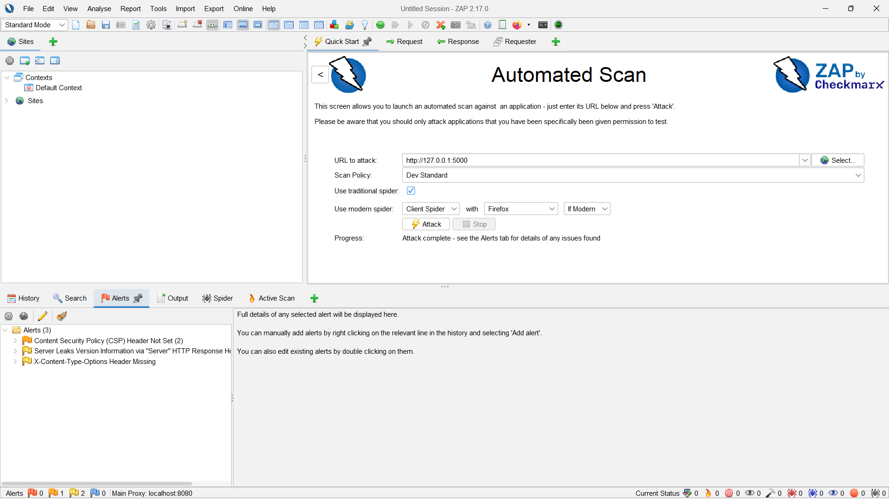

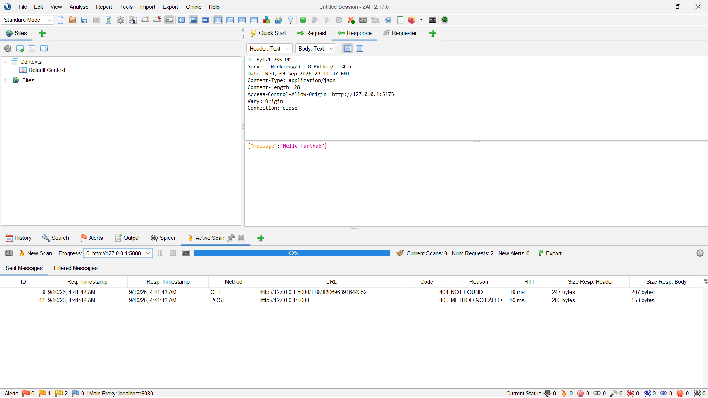

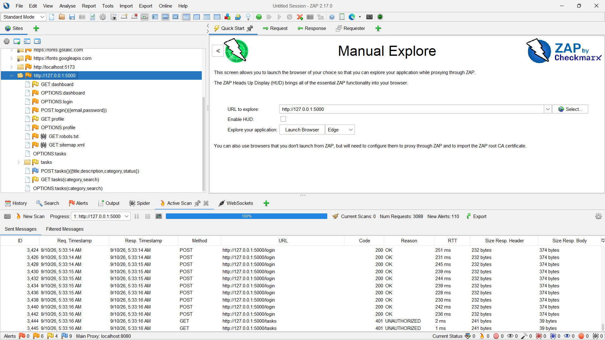

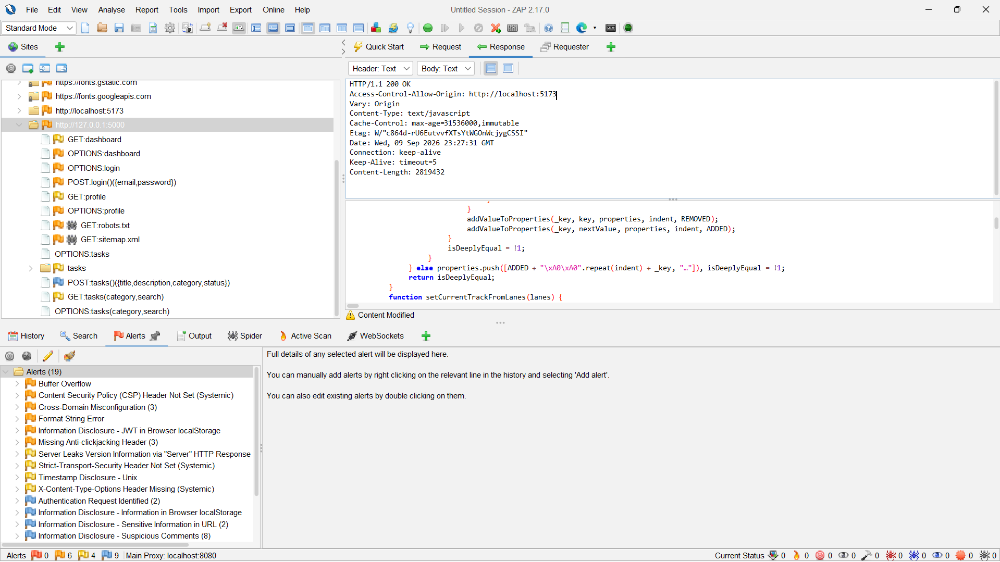

---

# 4. ZAP Application Traffic Analysis

Normal application traffic was captured through the ZAP browser environment.

## Server Version Detection

ZAP identified server version information in HTTP responses.

## Evidence

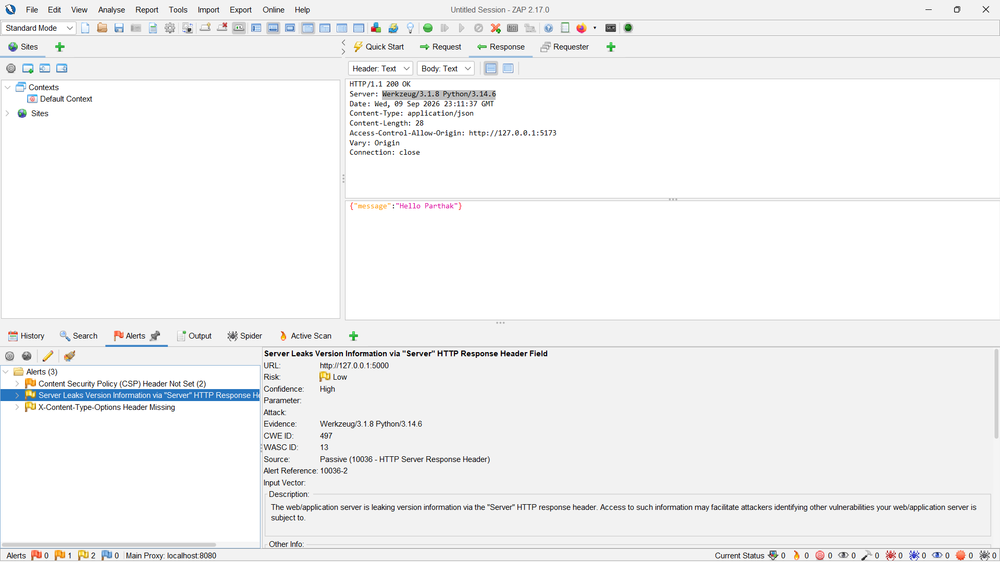

This finding was treated as an information-disclosure/hardening observation rather than a confirmed exploitable application vulnerability.

## X-Content-Type-Options

ZAP also identified an X-Content-Type-Options-related header issue.

## Evidence

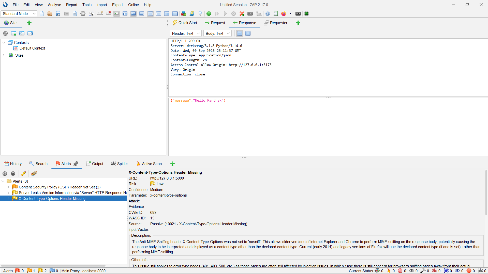

This was treated as a security-header hardening observation.

## Authenticated Traffic

Authenticated application traffic was captured to allow ZAP to observe protected application functionality.

## Evidence

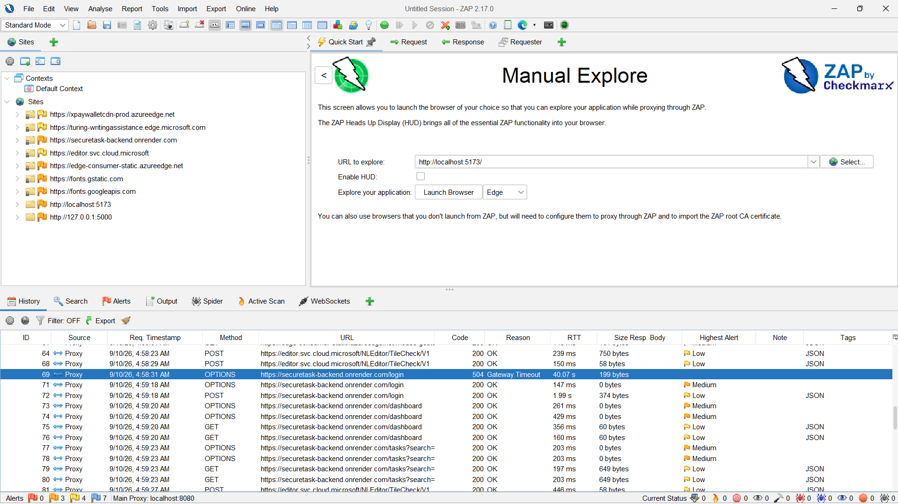

## Local API Traffic

The local backend API traffic generated by SecureTask was also captured and reviewed.

## Evidence

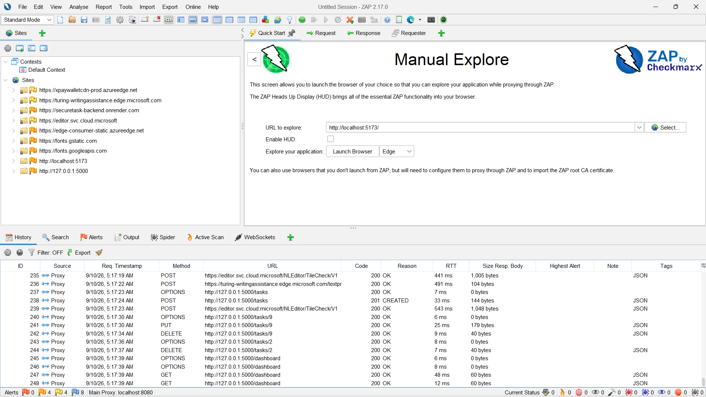

---

# 5. ZAP Finding — Buffer Overflow / Password-Length Handling

## Detection

OWASP ZAP identified a Medium-severity Buffer Overflow alert associated with input submitted to the authentication endpoint.

**Severity:** Medium

The finding was manually investigated to determine whether it represented an actual application-level issue.

## Evidence

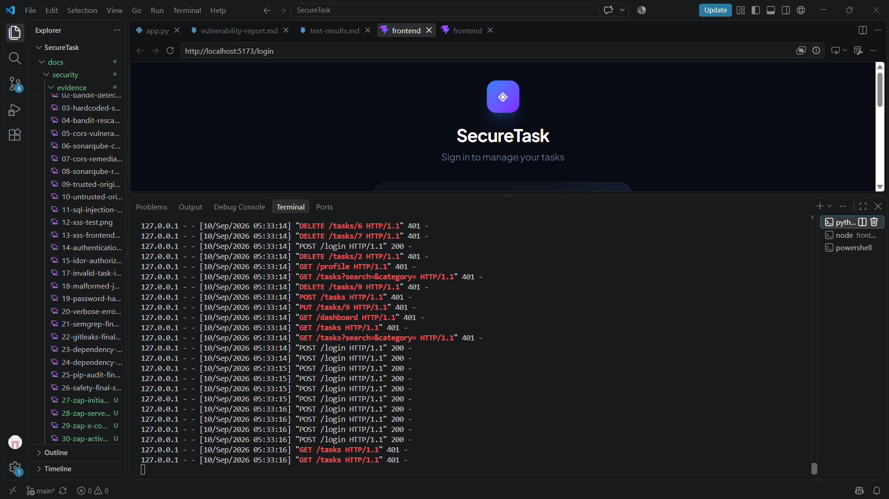

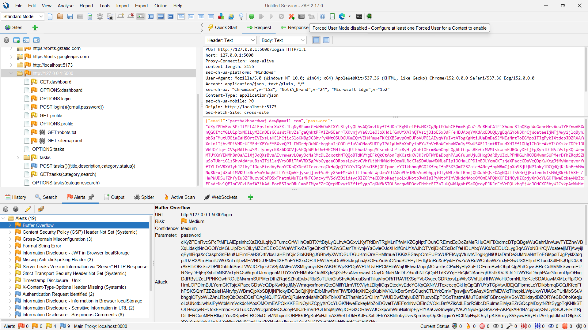

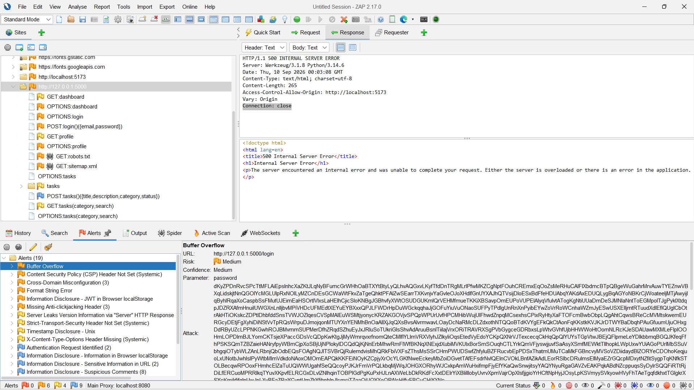

---

## Analysis

Manual reproduction showed that an excessively long password submitted to the login endpoint caused the backend to return an HTTP 500 response.

The underlying exception originated from bcrypt password verification because bcrypt does not accept passwords beyond its supported 72-byte input limit.

The application therefore lacked explicit validation of the password length before passing the value to bcrypt.

The issue was classified as an input-validation and robustness problem rather than treating the ZAP alert label alone as the final root cause.

---

## Remediation

Password byte-length validation was added before bcrypt processing in both registration and login handling.

Passwords exceeding 72 bytes are now rejected with a controlled HTTP 400 response.

The application therefore prevents oversized password input from reaching the bcrypt verification function.

## Evidence

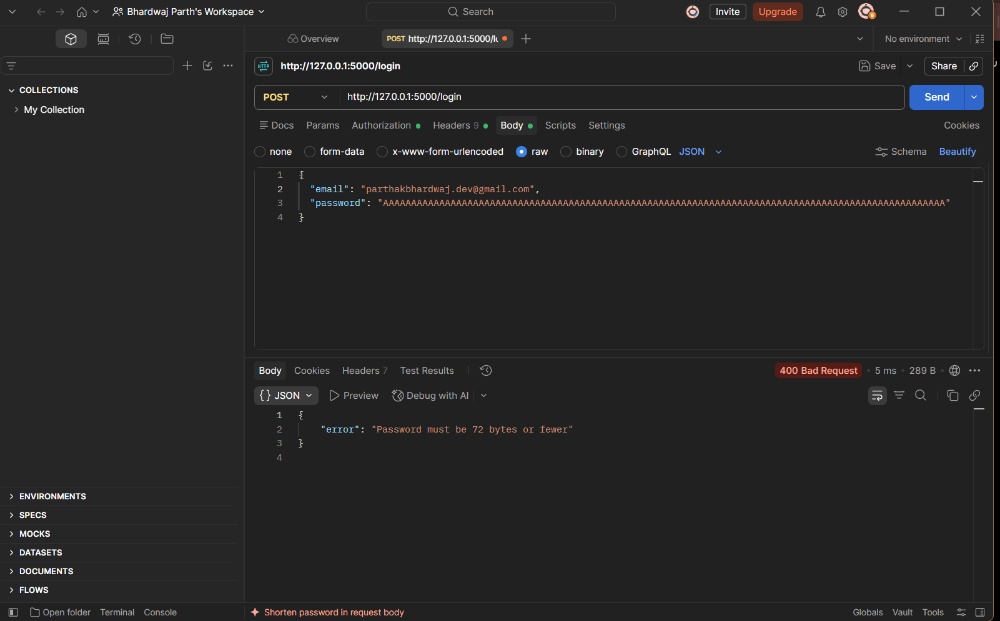

---

## Verification

After remediation, the same oversized-password test was repeated manually.

The application returned:

`400 Bad Request`

with the controlled validation message:

`Password must be 72 bytes or fewer`

No Python traceback or bcrypt exception was exposed to the client.

This confirmed that the original 500-error behavior was removed and the input was handled through explicit validation.

**Status:** REMEDIATED AND MANUALLY VERIFIED

---

# 6. ZAP Finding — Format String Error

## Detection

ZAP also reported a Medium-severity Format String Error alert involving the password parameter.

## Evidence

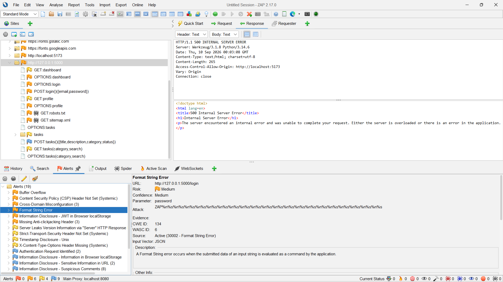

---

## Root-Cause Analysis

Manual analysis showed that the observed server error was associated with the same oversized-password condition identified during investigation of the Buffer Overflow alert.

The underlying bcrypt password-length limitation was the relevant application-level cause.

The ZAP alert classification was therefore not treated as evidence of a separate format-string vulnerability without supporting application behavior.

## Evidence

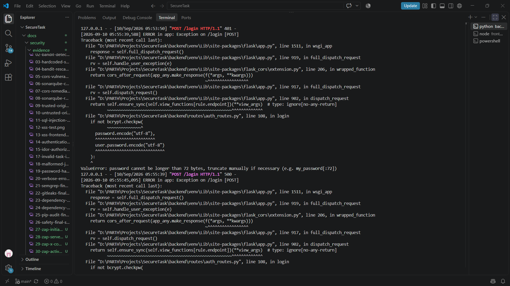

---

## Remediation and Verification

The same password byte-length validation introduced for the Buffer Overflow finding prevents oversized password values from reaching bcrypt.

The affected input is now rejected with a controlled HTTP 400 response rather than producing a server-side exception.

**Status:** ANALYZED, REMEDIATED THROUGH INPUT VALIDATION, AND MANUALLY VERIFIED

---

# 7. ZAP Finding — CSP Header Not Set

ZAP identified a Medium-severity CSP Header Not Set alert.

## Evidence

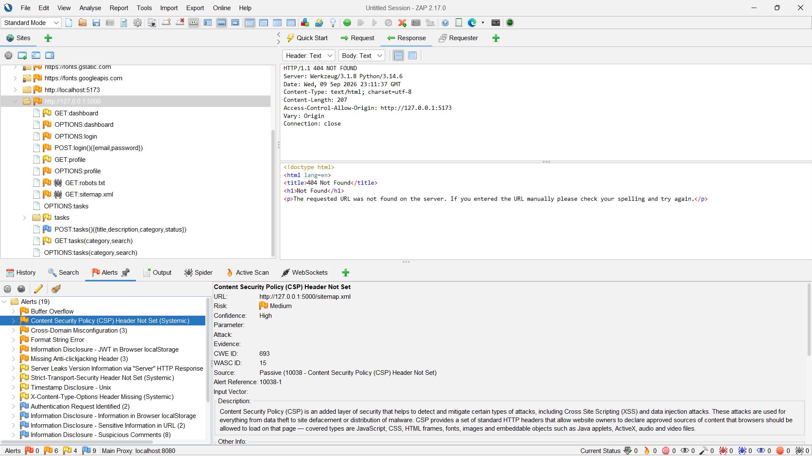

The finding was reviewed as a security-header hardening issue.

It was documented as part of the DAST assessment rather than classified as a confirmed exploitable application vulnerability.

**Status:** REVIEWED / HARDENING OBSERVATION

---

# 8. ZAP Finding — Cross-Domain Misconfiguration

ZAP identified a Cross-Domain Misconfiguration alert.

## Evidence

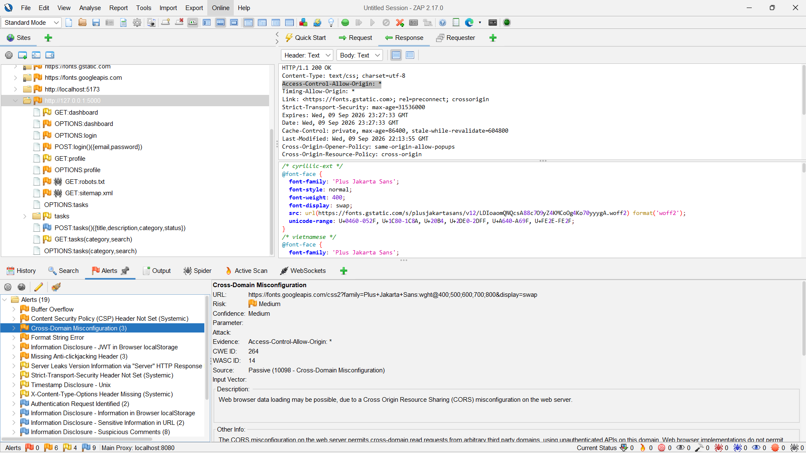

The alert was reviewed manually.

The observed cross-domain behavior involved an external resource such as Google Fonts rather than representing an unrestricted SecureTask backend CORS policy.

SecureTask's backend CORS configuration had already been restricted to explicitly trusted application origins and had been verified using both trusted and untrusted Origin headers.

**Status:** REVIEWED / NOT TREATED AS A CONFIRMED SECURETASK BACKEND VULNERABILITY

---

# 9. Informational ZAP Findings

ZAP also generated several informational findings during the assessment.

These findings were reviewed individually rather than automatically treating every scanner alert as a confirmed vulnerability.

---

## Information Disclosure — Browser localStorage

ZAP identified the application's JWT access token being stored in browser localStorage.

## Evidence

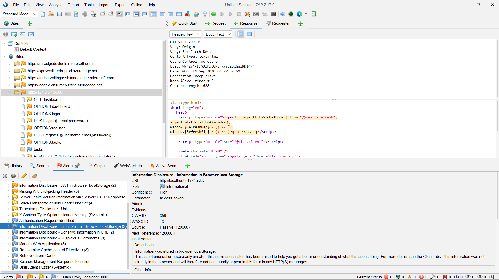

This was recorded as an informational security observation related to client-side token storage.

**Status:** INFORMATIONAL / REVIEWED

---

## Information Disclosure — Sensitive Information in URL

ZAP identified a token value in a local development URL.

## Evidence

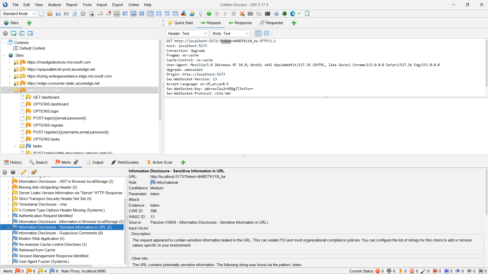

The observation was associated with the local Vite/React development environment rather than the SecureTask backend authentication API.

It was therefore treated as a development-environment observation and not classified as a confirmed production authentication vulnerability.

**Status:** INFORMATIONAL / DEVELOPMENT ENVIRONMENT OBSERVATION

---

## Session Management Response Identified

ZAP identified a session-management response associated with the login endpoint and JWT authentication response.

## Evidence

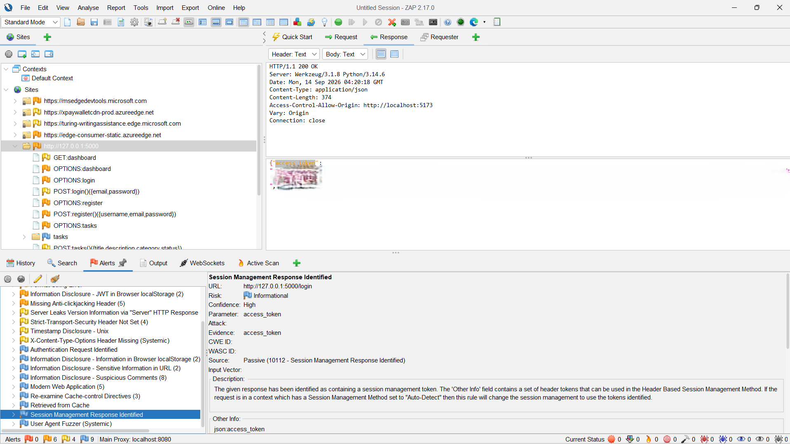

The evidence screenshot was sanitized before repository inclusion so that authentication token values were not retained as repository evidence.

The finding represents ZAP's identification of the application's authentication token response rather than a confirmed vulnerability by itself.

**Status:** INFORMATIONAL

---

# 10. Additional Informational / Systemic Findings

The ZAP assessment also reported informational or systemic observations involving development tooling and external resources.

Examples included:

- Suspicious Comments
- Modern Web Application
- Re-examine Cache-control Directives
- Retrieved from Cache
- User Agent Fuzzer
- Authentication Request Identified
- Additional security-header observations

These findings were reviewed and were not automatically classified as exploitable SecureTask vulnerabilities.

Some observations originated from the local Vite/React development environment or third-party resources rather than the SecureTask backend application.

**Status:** REVIEWED / CONTEXTUAL

---

# 11. ZAP Evidence Summary

| Screenshot | Evidence |
|---|---|
| 27 | ZAP initial scan |
| 28 | ZAP server version detection |
| 29 | ZAP X-Content-Type-Options detection |
| 30 | ZAP Active Scan |
| 31 | ZAP authenticated traffic |
| 32 | ZAP local API traffic |
| 33 | ZAP Active Scan complete |
| 34 | ZAP alert overview |
| 35 | ZAP Buffer Overflow analysis |
| 36 | ZAP Buffer Overflow request |
| 37 | ZAP Buffer Overflow alert |
| 38 | ZAP CSP Header Not Set |
| 39 | ZAP Cross-Domain Misconfiguration |
| 40 | ZAP Format String Error |
| 41 | ZAP Format String Error root-cause analysis |
| 42 | ZAP Buffer Overflow remediation |
| 43 | ZAP Active Scan complete |
| 44 | ZAP Information Disclosure — browser localStorage |
| 45 | ZAP Information Disclosure — sensitive information in URL |
| 46 | ZAP Session Management Response Identified |

---

# 12. Week 6/7 Security Outcome

OWASP ZAP successfully performed dynamic security testing against the locally running SecureTask application.

The initial assessment generated:

- 3,465 requests
- 86 alert instances
- 19 distinct alert types

The alerts were reviewed individually to distinguish confirmed application issues from informational, systemic, development-environment, and third-party observations.

The most significant application-specific issue identified during the assessment was excessive password input causing a server-side bcrypt exception and HTTP 500 response.

The root cause was identified as missing password byte-length validation before bcrypt processing.

The issue was remediated by adding explicit 72-byte password validation to the registration and login flows.

After remediation, the same oversized input was manually re-tested and returned a controlled HTTP 400 response without exposing a server traceback.

The ZAP Format String Error was also analyzed and found to have the same underlying bcrypt password-length root cause. The input-validation remediation addressed this behavior as well.

The CSP Header Not Set and Cross-Domain Misconfiguration findings were reviewed and documented as hardening or contextual observations rather than confirmed exploitable SecureTask backend vulnerabilities.

Informational findings involving browser localStorage, development URLs, and session-management responses were documented for security awareness and were not treated as confirmed vulnerabilities without additional evidence.

A complete post-remediation ZAP Active Scan was not performed and therefore the assessment does not claim that all original ZAP alert instances were cleared by a subsequent automated scan.

**Week 6/7 OWASP ZAP Dynamic Security Assessment: COMPLETE**

**Application-specific ZAP issue: REMEDIATED AND MANUALLY VERIFIED**

---

# 13. Updated Security Assessment Status

| Security Area | Result | Status |
|---|---|---|
| Manual Security Testing | Security controls verified | PASS |
| Bandit | 0 findings after remediation | PASS |
| Semgrep OSS | 0 findings | PASS |
| Gitleaks | 0 leaks | PASS |
| OWASP Dependency-Check | 0 vulnerabilities after remediation | PASS |
| pip-audit | 0 vulnerabilities in application dependencies | PASS |
| Safety | 0 vulnerabilities in application dependencies | PASS |
| SonarQube Security | 0 security vulnerabilities after remediation | PASS |
| CORS Runtime Verification | Trusted origin allowed; untrusted origin rejected | PASS |
| Password-Length Validation | Oversized input controlled with HTTP 400 | PASS |
| OWASP ZAP DAST | Findings reviewed and application-specific issue remediated and manually verified | COMPLETE / REVIEWED |

The ZAP status does not indicate that every scanner observation was eliminated. It indicates that the DAST findings were reviewed, the application-specific issue was remediated, and the affected behavior was manually verified.

---

# 14. Final Security Lifecycle

The complete security assessment followed:

**Scan → Detection → Analysis → Remediation → Re-scan / Re-test → Verification → Outcome**

The assessment included:

- Manual security testing
- Controlled vulnerability introduction
- Static application security testing
- Secret scanning
- Dependency vulnerability scanning
- Code-quality and security analysis
- Dynamic application security testing
- Runtime CORS verification
- Input-validation testing
- Authentication and authorization testing
- Password hashing verification

Controlled vulnerabilities, the identified dependency vulnerability, the permissive CORS configuration, and the ZAP-detected password input-handling issue were analyzed and remediated where applicable.

Scanner-generated alerts were manually reviewed to avoid incorrectly classifying informational, contextual, development-environment, or third-party observations as confirmed application vulnerabilities.

The final SecureTask application state contains the implemented security remediations and documented evidence from the completed security assessment.

**Overall Security Assessment: COMPLETED**

**Confirmed application-specific security issues identified during testing were remediated and verified where applicable.**

---

# Security Evidence

All security testing screenshots are maintained in:

`docs/security/evidence/`

Evidence numbering covers:

- 01–15
- 17–46

Evidence item 16 is intentionally absent from the sequence.

The evidence set includes manual testing, controlled vulnerability testing, SAST, secret scanning, dependency assessment, SonarQube analysis, OWASP ZAP DAST, remediation, and verification screenshots.

---

# Final Security Status

| Category | Final Result |
|---|---|
| Authentication | PASS |
| Authorization / IDOR Protection | PASS |
| SQL Injection Protection | PASS |
| XSS Protection | PASS |
| Password Hashing | PASS |
| Secret Management | PASS |
| CORS Configuration | PASS |
| Static Security Analysis | PASS |
| Secret Scanning | PASS |
| Dependency Security | PASS |
| Code Security Analysis | PASS |
| Dynamic Security Testing | COMPLETE / REVIEWED |
| Input Validation | REMEDIATED AND VERIFIED |
| Security Documentation | COMPLETE |

**SecureTask Security Assessment: COMPLETE**