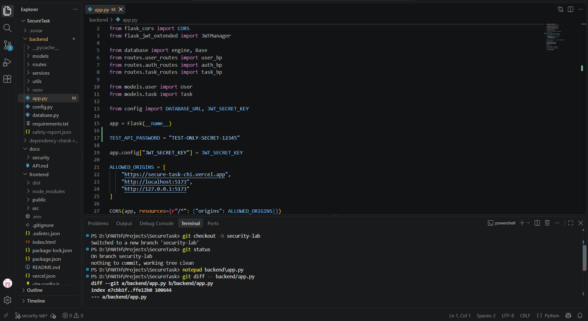
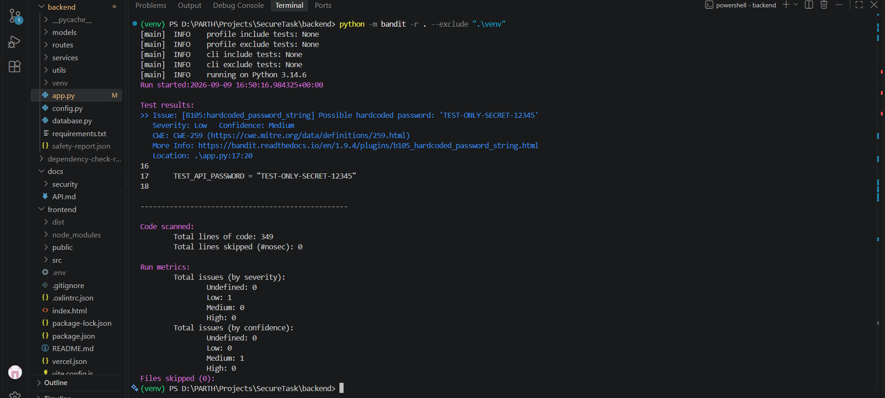
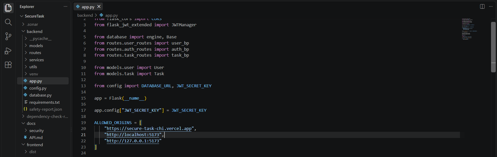
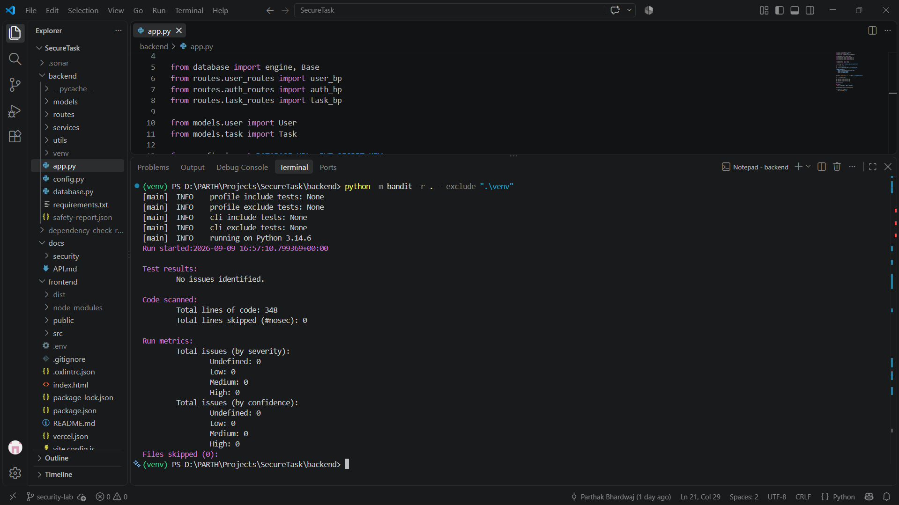
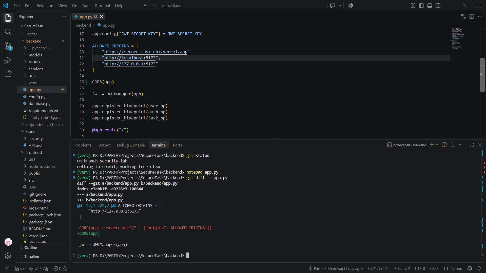
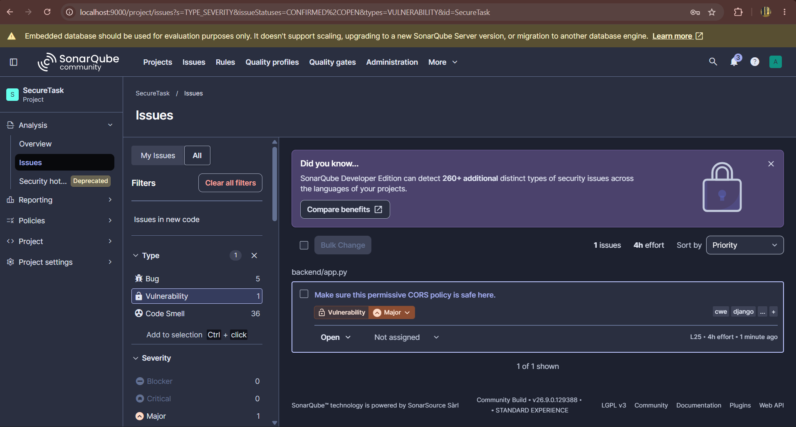
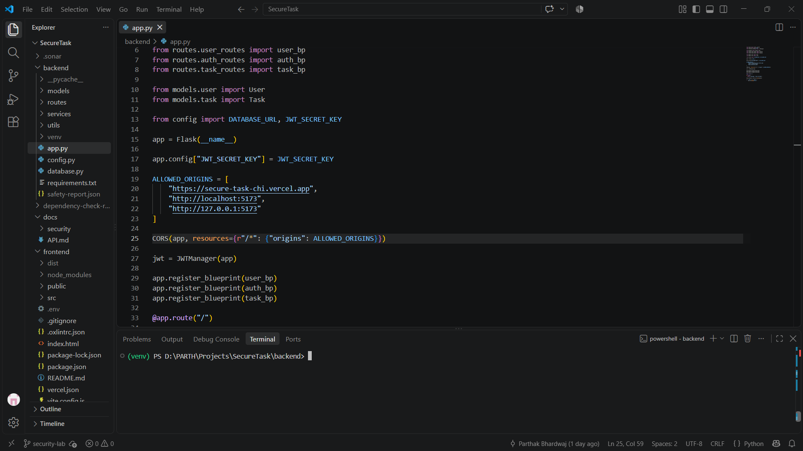
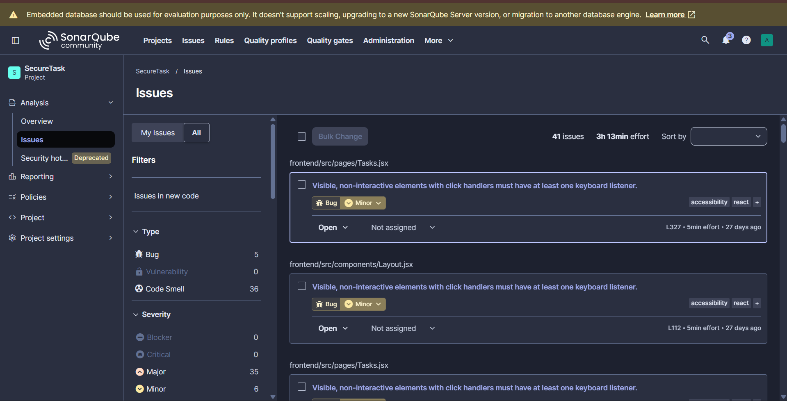
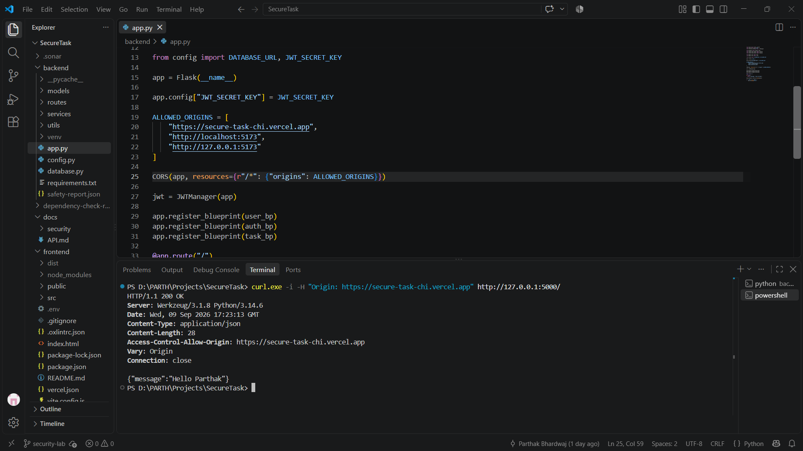
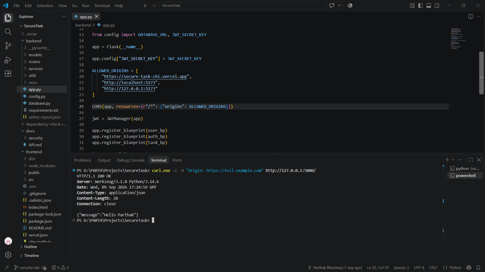

# SecureTask Security Vulnerability Report

## 1. Executive Summary

SecureTask underwent manual security testing, static analysis, secret scanning, dependency analysis, and controlled vulnerability remediation.

To validate the effectiveness of the security tools, controlled vulnerabilities were introduced only in the isolated `security-lab` branch.

The assessment followed:

    Scan → Detection → Analysis → Remediation → Re-scan → Verification → Outcome

### Controlled Vulnerability Results

| Vulnerability | Tool | Severity | Result |
|---|---|---:|---|
| Hardcoded Secret | Bandit B105 | Low | Remediated |
| Permissive CORS | SonarQube S5122 | Major | Remediated |

No intentional vulnerability was deployed to production.

---

## 2. Objective and Scope

### Objective

- Validate the effectiveness of security analysis tools
- Identify controlled vulnerabilities
- Analyze root cause and impact
- Apply remediation
- Re-scan after remediation
- Verify the security controls
- Maintain screenshot-based evidence

### Scope

Testing covered:

- Authentication and authorization
- SQL Injection
- XSS
- IDOR
- Password hashing
- Hardcoded secrets
- Error handling
- Static security analysis
- Dependency vulnerabilities
- CORS configuration

Directory traversal and insecure file upload were Not Applicable because SecureTask does not provide user-controlled filesystem paths or file-upload functionality.

---

## 3. Tools Used

| Tool | Purpose |
|---|---|
| Bandit | Python security analysis |
| Semgrep OSS | Static security analysis |
| Gitleaks | Secret scanning |
| OWASP Dependency-Check | Dependency CVE analysis |
| pip-audit | Python dependency analysis |
| Safety | Dependency security analysis |
| SonarQube Community Build | Security and code-quality analysis |
| curl.exe | Runtime CORS verification |

---

# 4. Controlled Vulnerability Testing

## 4.1 Hardcoded Secret — Bandit B105

### Introduction

A fake credential was intentionally added to `backend/app.py`:

    TEST_API_PASSWORD = "TEST-ONLY-SECRET-12345"

The change was made only on the `security-lab` branch.

**Evidence:** Screenshot 1 — Controlled Secret Introduction

### Detection

Bandit detected:

    B105:hardcoded_password_string
    Severity: Low
    Confidence: Medium
    CWE: CWE-259

**Evidence:** Screenshot 2 — Bandit Detection

### Root Cause

A credential-like value was embedded directly in application source code.

### Impact

If a real credential were hardcoded, source-code access could expose the credential and make secure rotation difficult.

### Remediation

The hardcoded value was removed. Sensitive application configuration is stored through environment-based configuration.

**Evidence:** Screenshot 3 — Remediation

### Re-scan

Bandit was executed again:

    python -m bandit -r . --exclude ".\venv"

Result:

    High: 0
    Medium: 0
    Low: 0

**Evidence:** Screenshot 4 — Bandit Re-scan

### Outcome

| Before | After |
|---|---|
| B105 — Low | 0 findings |

**Status: Remediated**

---

## 4.2 Permissive CORS — SonarQube S5122

### Introduction

SecureTask normally restricts CORS to trusted origins.

For controlled testing, the configuration was intentionally changed to:

    CORS(app)

The change was made only on the `security-lab` branch.

**Evidence:** Screenshot 5 — Controlled CORS Vulnerability

### Detection

SonarQube detected:

    python:S5122
    Make sure this permissive CORS policy is safe here.

    Type: Vulnerability
    Severity: Major
    Location: backend/app.py

**Evidence:** Screenshot 6 — SonarQube Detection

### Root Cause

`CORS(app)` allowed a broader cross-origin policy than required by the application.

### Impact

An overly permissive CORS policy can allow untrusted websites to interact with application endpoints through cross-origin requests.

### Remediation

The configuration was restricted to explicitly trusted origins:

    ALLOWED_ORIGINS = [
        "https://secure-task-chi.vercel.app",
        "http://localhost:5173",
        "http://127.0.0.1:5173"
    ]

    CORS(app, resources={r"/*": {"origins": ALLOWED_ORIGINS}})

**Evidence:** Screenshot 7 — CORS Remediation

### Re-scan

SonarQube was executed again.

Result:

    Vulnerabilities: 0

The S5122 vulnerability was no longer reported.

**Evidence:** Screenshot 8 — SonarQube Re-scan

### Runtime Verification

#### Trusted Origin

Test:

    curl.exe -i -H "Origin: https://secure-task-chi.vercel.app" http://127.0.0.1:5000/

Result:

    Access-Control-Allow-Origin: https://secure-task-chi.vercel.app

The trusted production frontend was allowed.

**Evidence:** Screenshot 9 — Trusted Origin Verification

#### Untrusted Origin

Test:

    curl.exe -i -H "Origin: https://evil-example.com" http://127.0.0.1:5000/

The response did not contain:

    Access-Control-Allow-Origin: https://evil-example.com

The untrusted origin was therefore not granted CORS permission.

**Evidence:** Screenshot 10 — Untrusted Origin Verification

### Outcome

| Before | After |
|---|---|
| S5122 — Major | 0 vulnerabilities |
| Permissive CORS | Restricted allowlist |
| Untrusted origin allowed by policy | Untrusted origin not granted CORS permission |

**Status: Remediated**

---

# 5. Historical Security Assessment

## Week 3 — Manual Security Testing

| Test | Result |
|---|---|
| SQL Injection | PASS |
| XSS | PASS |
| Hardcoded Secrets | PASS |
| Password Hashing | PASS |
| Authentication Bypass | PASS |
| IDOR / Authorization | PASS |
| Verbose Error Handling | PASS |
| Directory Traversal | N/A |
| Insecure File Upload | N/A |

## Week 4 — SAST and Secret Scanning

| Tool | Result |
|---|---|
| Bandit | 0 findings after remediation |
| Semgrep OSS | 0 findings |
| Gitleaks | 0 leaks |

Bandit initially identified B105 and B201. Both were remediated.

## Week 5 — Dependency Security

| Tool | Result |
|---|---|
| OWASP Dependency-Check | 0 CVEs |
| pip-audit — Application Dependencies | 0 vulnerabilities |
| Safety — Application Dependencies | 0 issues |

The complete development environment contained an additional `nltk 3.10.3` finding. This package was installed through the development/security tooling environment and is not part of SecureTask's declared application dependencies.

---

# 6. Final Results

| Security Area | Final Result |
|---|---|
| Manual Security Testing | PASS |
| Bandit | 0 findings |
| Semgrep OSS | 0 findings |
| Gitleaks | 0 leaks |
| OWASP Dependency-Check | 0 CVEs |
| pip-audit | 0 application dependency vulnerabilities |
| Safety | 0 application dependency issues |
| SonarQube | 0 vulnerabilities |
| Hardcoded Secret | Remediated |
| Permissive CORS | Remediated |

---

# 7. Evidence Index

| Screenshot | Evidence |
|---|---|
| 1 | Controlled hardcoded-secret introduction |
| 2 | Bandit B105 detection |
| 3 | Hardcoded-secret remediation |
| 4 | Bandit re-scan |
| 5 | Controlled CORS vulnerability |
| 6 | SonarQube S5122 — Major |
| 7 | CORS remediation |
| 8 | SonarQube re-scan — 0 vulnerabilities |
| 9 | Trusted-origin runtime verification |
| 10 | Untrusted-origin runtime verification |

---

# 8. Conclusion

The assessment demonstrates the complete security remediation lifecycle:

    Scan
      ↓
    Detection
      ↓
    Analysis
      ↓
    Remediation
      ↓
    Re-scan
      ↓
    Verification
      ↓
    Outcome

Controlled vulnerabilities were successfully detected, analyzed, remediated, and verified.

All intentional vulnerabilities were restricted to the `security-lab` branch and were not deployed to production.